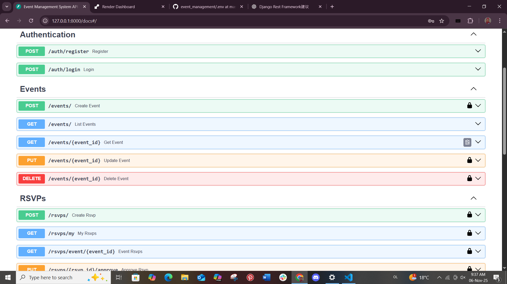

## README.md — Event Management System API

## Overview

The Event Management API is a backend application built with FastAPI and PostgreSQL.
It allows users to register and log in, organizers to create and manage events, and attendees to RSVP.
Authentication is implemented using JWT tokens, and event listings support pagination and filtering by date, location, or keyword.

## Features 
 User registration and login

 Token-based authentication (JWT)

 Organizers can create, update, and delete events

 Users can RSVP to events

 RSVP approval by organizers

 Limit maximum attendees per event

 Pagination for event lists

 Filter events by date, location, or keyword

 PostgreSQL database

 Swagger UI documentation at /docs

## TechStack
Backend Framework: FastAPI

Database: PostgreSQL

ORM: SQLAlchemy

Authentication: JWT

Documentation: Swagger UI (built-in with FastAPI)

## SETUP INSTRUCTIONS

1. Clone the repository using this command: 
         git clone https://github.com/Areliano/event_management.git

   Open the project folder using your IDE and navigate to the terminal

2. Install dependencies using this command on the terminal 
          pip install -r requirements.txt

3.  Run the project using this command on the terminal 
          uvicorn app.main:app --reload

4. On your browser, navigate to this URL
      http://127.0.0.1:8000/docs

gitThis is what you will see and how the endpoints will be displayed 

